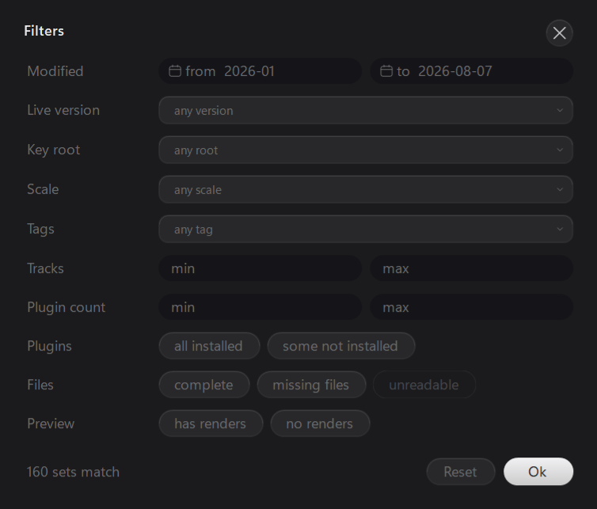
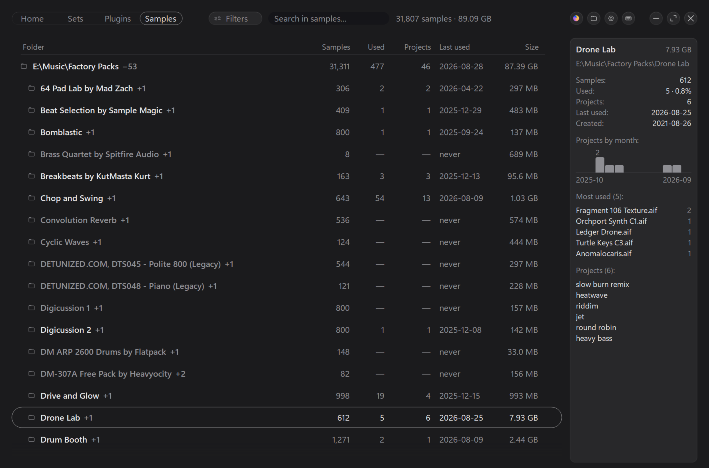
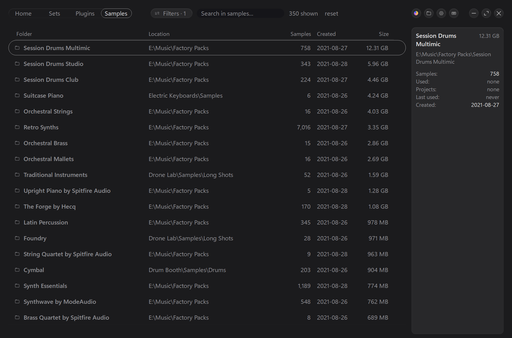
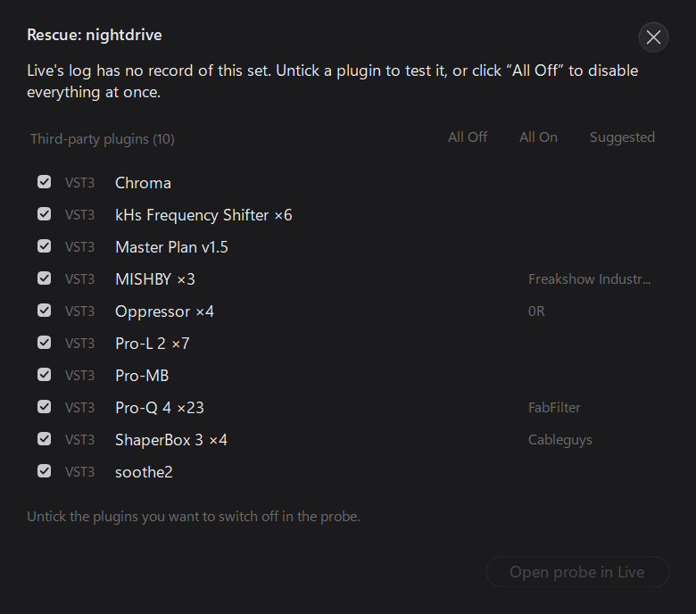

<div align="center">


# Alive

**A fast, portable catalog for your Ableton Live projects, plugins and samples.**

One `.exe`. No installer, no external DLLs, no runtime to download.


[**Download**](../../releases) · [Features](#features) · [Shortcuts](#keyboard-shortcuts) · [Build](#building-from-source) · [Русский](README.ru.md)


</div>

---

## Why

A few years of Live leave you with hundreds of `.als` files in dozens of folders, each project with
its own pile of backups. Explorer shows names and dates, and that's it. Alive opens the sets
themselves and shows what's inside: tempo, key, plugins, samples, and which version is the latest.

## Features

### Home

Every project is a tile with a picture of its arrangement, so you know a track by its shape before
you read the name. A star keeps a project at the front; the play button plays the render next to
the set.

Above the tiles is your year in Live: the days you worked, your current streak and your record, the
hour you usually start, and how much the whole library weighs.

### Sets


- **Everything about a set at a glance:** tempo, key, Live version, tracks, plugins, files, and the
  size of the whole project folder.
- **One row per project.** `v1`, `final` and `final 2` fold into one line; the counter at the end
  unfolds it.
- **Filters** (`F`): date, Live version, key, number of tracks and plugins, missing files, renders.
  **Search** with `Ctrl F`. Pick the columns you want.
- **Tags and notes** (`Ctrl T`). They belong to the project folder, so they survive the day
  `final 3.als` appears.
- New sets show up on their own, no rescan needed.



### Plugins


All your plugins in one list (`Ctrl 3`): who makes each one, how many sets use it, and whether it's
still installed. The list comes from Live's own plugin database, or from your VST2/VST3 folders if
you prefer.

### Samples



Which packs you actually use, and which you downloaded and never touched (`Ctrl 4`). Add your sample
folders, or take the ones Live already knows about.

- Usage is counted **by projects**: ten versions of one track count once.
- **Never used**: the biggest folders you never took a single sound from.
- **Most used**: your go-to sounds.
- **Duplicates**: the same file sitting in several places, biggest waste first.
- Click a sample to hear it, like in Live's browser, and drag it straight into Live.
- A set's panel on the Sets tab lists the sample folders it uses; a click opens that folder here.



Alive never moves or deletes samples: that would break every set that uses them. It shows you what's
safe to clean up, and you do the cleaning in Explorer.

### Rescue



A set won't open? Alive reads Live's log and names the plugin it crashed on. If the log says
nothing, Alive finds the culprit itself by switching plugins off in a copy of the set until it
opens. The original set is never touched.

### Export


Gather everything a set needs (your samples, files from other projects, User Library, packs) into
one folder or `.zip`, like Live's *Collect All and Save*. Before you start, you see how many files
and gigabytes each group adds. The original set stays as it is.

### Preview and player


`Ctrl Space` shows the whole arrangement as one picture, in Live's clip colours. `Space` plays the
render lying next to the set; you can pick which file counts as the main one.

### Stat


Your whole library as a cloud of dots, one per project. You choose what the axes, the dot size and
the colour show: tempo, number of tracks, year, and so on.

### Settings


`Ctrl ,` or the gear: smooth scrolling, transparency and the update check (all three start off), and
where the plugin list comes from.

**Updates.** Alive goes online only when you ask: press **Check for updates**, or turn on the daily
check and a dot on the gear will tell you about a new version. Nothing about you or your library is
sent.

The same window links to this repo and to the developer's Telegram channel,
[t.me/RueBlose](https://t.me/RueBlose), and opens the [data folder](#data-folder).

---

## Download

Grab the archive from [Releases](../../releases).

1. Unpack it.
2. Run `Alive.exe`.
3. Point it at your Ableton project folders and press **Scan**.

Needs **.NET Framework 4.6+**, which comes with Windows 10 and 11.

---

## Keyboard shortcuts

| | | | |
|---|---|---|---|
| `F1` | Help | `Enter` | Open set in Live |
| `Ctrl 1` … `Ctrl 4` | Home / Sets / Plugins / Samples | `Shift Enter` | Show in Explorer |
| `F` | Filters | `Space` | Play render or sample |
| `Shift F` | Scan folders | `Ctrl Space` | Arrangement preview |
| `Ctrl F` | Search | `Q` | Pin set |
| `Ctrl ,` | Settings | `Ctrl T` | Tags and notes |
| `F11` / `Ctrl M` | Fullscreen / minimize | `Ctrl R` | Rescue a set |
| `Ctrl Q` | Quit | `F5` | Rescan |
| | | `Ctrl N` | Launch Live |

---

## If something goes wrong

1. **"Windows protected your PC".** The app isn't code-signed, so SmartScreen warns about it. Click
   **More info → Run anyway**.
2. **Your antivirus flags it.** Alive copies files and writes archives, and some scanners find that
   suspicious. It's a false positive: every line of the code is in this repo and builds with one
   command. Add the folder to the exclusions.
3. **It closes right after starting.** If you downloaded it or got it in a messenger, right-click
   `Alive.exe` → **Properties** → tick **Unblock** → OK.
4. **No plugins, or only some.** Live must have run at least once, since the list comes from its
   database. Still empty? In Live, go to **Preferences → Plug-Ins → Rescan**, or tell Alive to scan
   your VST folders in Settings.
5. **Anything else.** Send `%APPDATA%\Alive\alive.log`: it says what happened during the last run.

---

## Data folder

Everything Alive remembers lives in `%APPDATA%\Alive` (**Settings → Data folder**). It writes
nothing anywhere else, not even to the registry, so deleting the folder resets it completely. Save
`activity.cache` and `notes.cfg` first: they can't be rebuilt.

| File | What's inside | If you delete it |
|---|---|---|
| `settings.cfg` | Settings: folders, columns, window size and position | Back to defaults |
| `index.cache` | What Alive read from your sets, so it doesn't reread every `.als` | Rebuilt by the next scan |
| `samples.cache` | Your sample library | Rebuilt in a minute or two |
| `activity.cache` | Your year of work shown on Home | **Gone for good** |
| `notes.cfg` | Your tags and notes | **Gone for good** |
| `home.cfg` | Starred projects | The stars are gone |
| `previews.cfg` | Which render plays for each project | Picked automatically again |
| `nebula.cfg` | Stat settings | Back to defaults |
| `thumbs\` | Arrangement pictures for the Home tiles | Drawn again when needed |
| `alive.log` | What happened during the last run | Nothing |
| `probes.txt` | Rescue's temporary copies, so they get cleaned up after a crash | Leftover `*.alive-probe.als` files stay behind |

Want to keep all this somewhere else, like next to a portable copy? Set the `ALIVE_HOME` environment
variable to a folder before you start Alive.

---

## Building from source

No IDE needed: Alive builds with the C# compiler that comes with .NET Framework 4.x, which is
already on your machine.

```cmd
build.cmd
```

You get `bin\Alive.exe`.

---

## Documentation

[FORMAT.md](FORMAT.md): how the `.als` format works, as far as 427 real sets showed. It's why Alive
can read a set without opening Live.

---

## License

[MIT](LICENSE).
