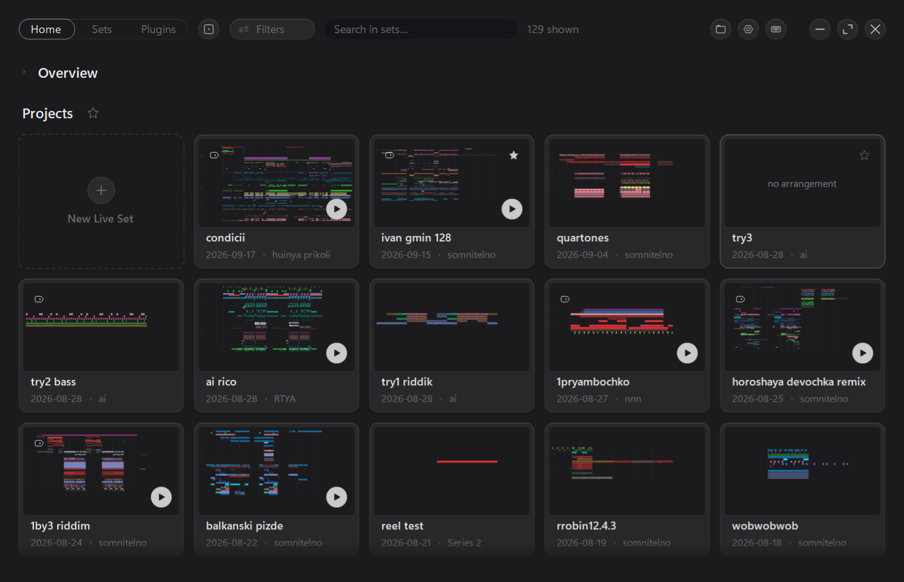
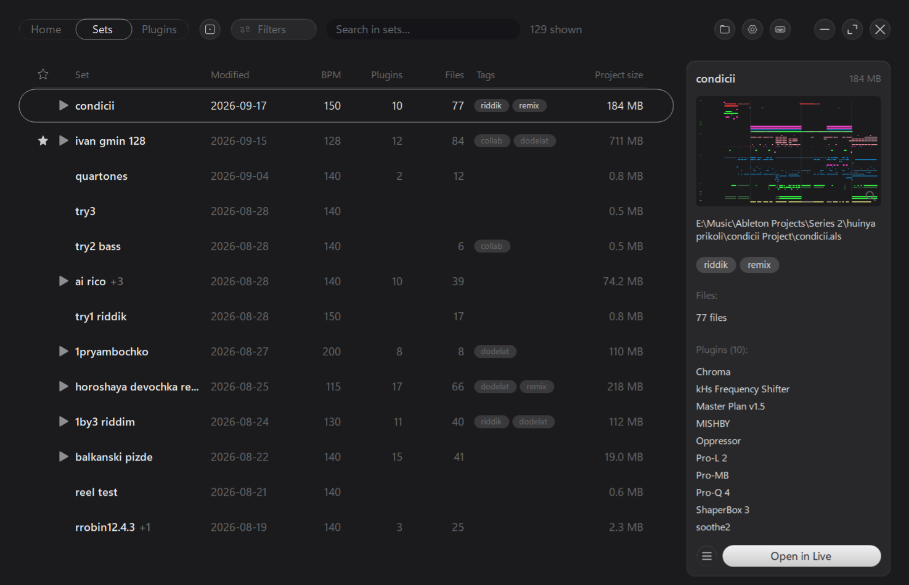
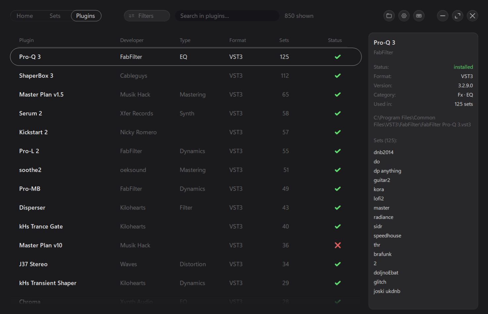
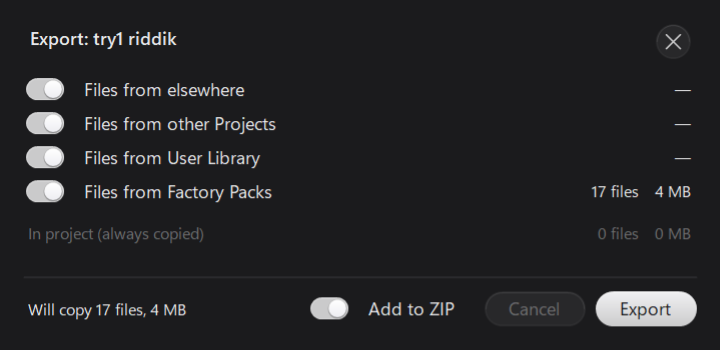
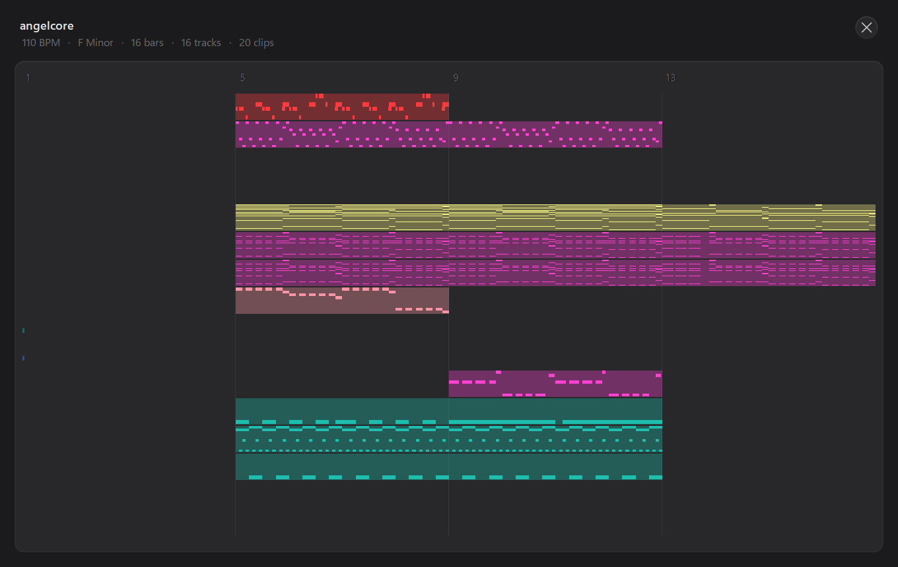
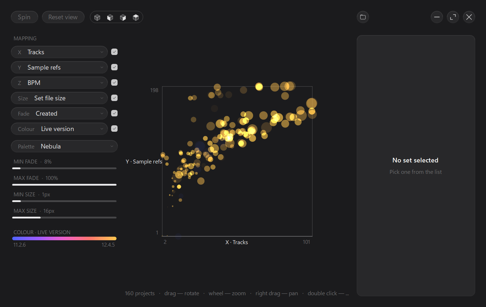
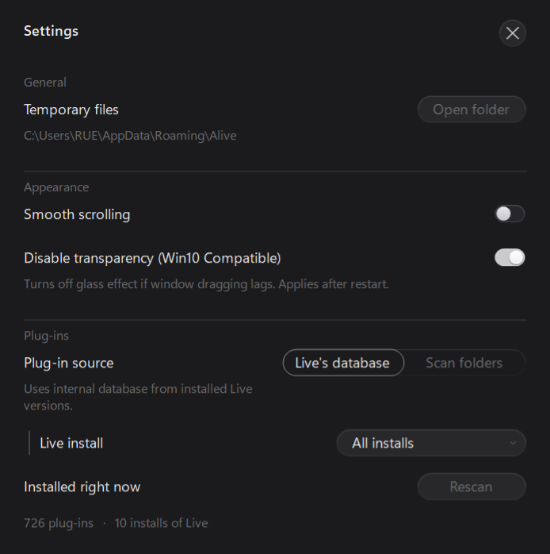

<div align="center">


# Alive

**Быстрый портативный каталог проектов и плагинов Ableton Live.**

Один `.exe`. Без установки, без внешних DLL, без рантайма.


[**Скачать**](../../releases) · [Возможности](#возможности) · [Клавиши](#горячие-клавиши) · [Сборка](#сборка-из-исходников) · [English](README.md)



</div>

---

## Зачем

За несколько лет Ableton оставляет несколько сотен `.als`, разбросанных по десятку папок, и у
каждого своя папка `Project`, а в ней `Backup` с почти одинаковыми копиями. Проводник показывает
имена и даты. Он не показывает темп, тональность, какие плагины нужны сету, стоят ли они ещё в
системе и какой из девяти файлов в папке — тот самый, который ты доделал.

Alive читает сами сеты и отвечает на эти вопросы.

Интерфейс программы английский, эта страница — перевод основной.

## Возможности

### Каталог



**Сеты разбираются, а не просто перечисляются.** Alive потоком идёт по `.als` (gzip поверх XML) и
достаёт темп, тональность и лад, версию Live, число треков, дату создания, вес всей папки проекта,
каждый плагин, который сет грузит, и каждый файл, на который он ссылается.

**Версии схлопываются.** У проекта обычно десяток `.als` — `v1`, `final`, `final 2`. Вся папка
сворачивается в одну строку, а хвостик со счётчиком раскрывает конкретные сеты.

**Фильтры и поиск.** `F` — фильтры по дате, версии Live, ноте и ладу, числу треков и плагинов,
состоянию файлов и наличию рендеров. `Ctrl F` — поиск по имени. Колонки таблицы настраиваются:
состав, порядок, ширины.

**Теги и заметки.** `Ctrl T` — свои метки и текст. Привязаны к *папке проекта*, а не к `.als`,
поэтому не теряются в тот день, когда рядом появляется `final 2.als`.

**Слежение за папками.** Новый сет появляется в каталоге сам, без `F5`.

### Плагины



Отдельная вкладка (`Ctrl 3`) со всей библиотекой: где стоит каждый, чем является, в скольких сетах
используется и установлен ли сейчас.

Состав берётся из **базы самой Live**, причём сразу из всех установленных версий: плагины стоят в
системе, а каждая установка Live — лишь снимок того, что она успела просканировать. Можно выбрать
конкретную установку или переключиться на обход папок VST2/VST3.

### Восстановление

Сет не открывается? Alive читает журнал самой Live и называет плагин, на котором она умерла —
`VST3: Going to restore: X`, последняя строка перед смертью. Журнал молчит — виновник ищется
пробами на копии.

**Оригинал не меняется никогда.** В *копии* сета подменяется только идентификатор плагина
(`Uid` / `UniqueId`), Live показывает его как «плагин не найден», а всё остальное — узлы, цепочки,
автоматизация, блоб пресета — остаётся байт в байт.

### Export



Собрать все медиафайлы сета — свои, из чужих проектов, из User Library, из факторных паков — в одну
переносимую папку или `.zip`. Те же четыре вопроса, что задаёт «Collect All and Save» самой Live,
плюс число файлов и вес по каждой категории **до** нажатия: паки часто тянут несколько гигабайт, и
это стоит видеть заранее, а не после.

Оригинал не меняется и здесь: пути переписываются только в `.als` копии. Не нашедшийся или не
скопировавшийся сэмпл не портит ссылку — она остаётся как в оригинале, а число потерь идёт в
уведомление.

### Звук и вид



**Превью аранжировки** (`Ctrl Space`) — картинка сета целиком, в клиповых цветах самой Live.

**Плеер рендеров** (`Space`) играет баунс, лежащий рядом с сетом. `Samples`, `Backup` и служебные
папки Live отброшены, остальное — по правдоподобности: `Render`/`Bounce`, потом корень проекта.
Любой файл можно закрепить главным превью.

**Векторный интерфейс.** Всё рисуется в коде и масштабируется под DPI. Горизонтальная прокрутка —
`Shift`+колесо, колонка имени остаётся на месте.

### Stat



Вся библиотека одним облаком точек. Каждый проект — точка, и шесть её свойств несут шесть величин
сета: оси, размер, прозрачность и цвет назначаются как угодно.

### Настройки и Options.txt



`Ctrl ,` или клик по названию программы в шапке. Плавная прокрутка, отключение прозрачности (на
Windows 10 акрил пересчитывается на каждый сдвиг окна, и оно едет за курсором с задержкой),
источник списка плагинов — и редактор скрытых опций самой Live: **153 опции** с описанием и
пометкой надёжности, галочкой вместо правки текстового файла, с резервной копией перед записью.
Подробности — в [docs/options-txt.md](docs/options-txt.md).

---

## Загрузка

Готовый архив — в разделе [Releases](../../releases).

1. Распакуйте архив.
2. Запустите `Alive.exe`.
3. Укажите папки с проектами Ableton Live и нажмите **Scan**.

Требуется **.NET Framework 4.6+** — он есть в Windows 10 и 11 из коробки.

---

## Горячие клавиши

| | | | |
|---|---|---|---|
| `F1` | Справка | `Enter` | Открыть сет в Live |
| `Ctrl 1` / `Ctrl 2` / `Ctrl 3` | Главная / Сеты / Плагины | `Shift Enter` | Показать в проводнике |
| `F` | Фильтры | `Space` | Слушать рендер |
| `Shift F` | Папки для сканирования | `Ctrl Space` | Превью аранжировки |
| `Ctrl F` | Поиск | `Q` | Закрепить сет |
| `Ctrl ,` | Настройки | `Ctrl T` | Теги и заметки |
| `F11` / `Ctrl M` | Полный экран / свернуть | `Ctrl R` | Восстановить сет |
| `Ctrl Q` | Выход | `F5` | Пересканировать |
| | | `Ctrl N` | Запустить Live |

---

## Не запускается / не видит плагины

1. **«Windows защитила ваш компьютер»** — приложение без цифровой подписи, SmartScreen ругается на
   все такие. Нажмите **Подробнее → Выполнить в любом случае**.

2. **Антивирус пометил файл.** Alive собирает файлы со всего диска, пишет их в архив и умеет
   положить пробную копию в папку проекта и отдать её Live — законное поведение, которое
   эвристики иногда засчитывают как дроппер. Сборка — обычный C#, скомпилированный из исходников
   этого репозитория, без упаковщика и обфускации; каждую строку можно прочитать здесь и собрать
   самому одной командой. Если сканер унёс файл в карантин, добавьте папку в исключения и, если не
   лень, отправьте вендору заявку о ложном срабатывании.

3. **Файл скачан или пришёл в мессенджере** — правой кнопкой по `Alive.exe` → **Свойства** →
   галочка **Разблокировать** → OK. Без неё Windows может закрыть программу молча.

4. **Пустой или неполный список плагинов** — Ableton Live должна была запуститься хотя бы раз:
   список берётся из её базы, а не из папок VST. Если он всё равно пуст, откройте
   **Live → Preferences → Plug-Ins → Rescan**. В настройках можно выбрать конкретную установку Live
   или переключиться на обход папок VST2/VST3.

5. **Что-то другое** — программа пишет журнал последнего запуска в `%APPDATA%\Alive\alive.log`:
   версия Windows, версия .NET, где нашлась Live и что именно не удалось. Этот файл — первое, что
   стоит прислать.

---

## Сборка из исходников

Тяжёлых IDE не нужно — Alive собирается компилятором C# из состава .NET Framework 4.x, который уже
стоит в системе.

```cmd
build.cmd
```

Появится `bin\Alive.exe`. Это всё.

> **Forks** — версии сета со снимками и семантическим diff — собраны, но выключены в интерфейсе:
> кнопка и `Ctrl H` возвращаются с раскомментированной строкой `AttachHistory` в
> [proto/Program.cs](proto/Program.cs). Окно открывается и напрямую — `Alive.exe --reel сет.als`.

---

## Документация

| | |
|---|---|
| [FORMAT.md](FORMAT.md) | Формат `.als` — что выяснено на 427 реальных сетах |
| [docs/options-txt.md](docs/options-txt.md) | Каталог опций `Options.txt` и откуда они известны |
| [proto/README.md](proto/README.md) | Forks и Stat: как устроены и как прицеплены к Alive |
| [PLANS.md](PLANS.md) | Что дальше |

---

## Лицензия

[MIT](LICENSE).
